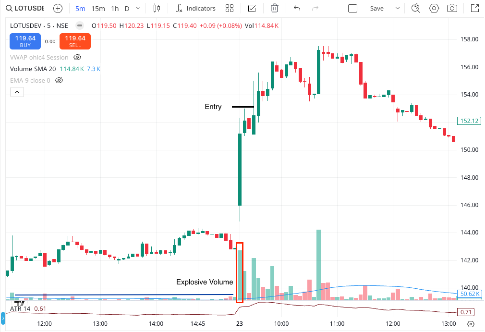

# Intraday Breakout Trade Setup Detection

This script analyzes **5-minute intraday candlestick data** to evaluate breakout setups for a given stock. It applies
**price-action and volume-based filters**, and any setup that passes those checks is sent as a
**trade alert via Telegram**.

The scanner **cannot evaluate higher-level context**—such as sector trend, higher-timeframe trend, or nearby supply
zones—so those must be reviewed **manually before taking any trade**.

## Pipeline Overview

The scanner runs as a three-phase daily pipeline, each phase triggered by a separate cron job.

---

### Phase 1 — Warmup

**Schedule:** `9:15 AM` · Runs once daily

Authenticates with the broker and caches session credentials for the day.

- Fetches and caches the Kite Connect access token
- Resolves and caches instrument tokens for all tracked symbols

---

### Phase 2 — Scan

**Schedule:** `9:20 AM` · Runs once daily

Discovers and alerts potential trade setups.

- Loads cached tokens from Phase 1
- Pulls latest candle data from Kite and append to existing data from DB
- Evaluates setup conditions across all symbols
- Fires alerts for qualifying setups

---

### Phase 3 — Backfill

**Schedule:** `3:35 PM` and `3:45 PM` · Runs twice daily

Persists candle data to the database for next-day indicator computation.

- Fetches all candles from the last stored timestamp to the market close
- Appends new candles to the historical buffer
- Evicts oldest candles beyond the limit
- Runs at 3:35 PM as primary job; 3:45 PM as a safety retry

---

### Execution Order

```
09:15 AM  →  Warmup   (auth + token cache)
09:20 AM  →  Scan     (setup discovery + alerts)
03:35 PM  →  Backfill (candle data persistence)
03:45 PM  →  Backfill (retry / safety run)
```

See [`crontab`](crontab) for the full cron schedule.

---


## ✨ Chart Configuration

* **Entry Timeframe**: 5-minute
* **Indicators**: ATR(14) and Volume SMA 20

---

## ✅ Setup

### 🔹 Explosive Volume Breakout

* Stock opens with explosive volume compared to average

  

### 1. Strong Bullish Breakout Candle
* **Wide body**: Candle body ≥ 60% of total range
* **Small/No upper wick**: Upper wick < 25%

### 2. Strong Volume

Volume ≥ 15x average volume(SMA 20 volume)

---

**Disclaimer:
No setup works forever. Markets evolve, and setups evolve with them. If you fail to adapt, your edge will gradually
disappear.**


---

## 🎯 Entry Strategy

* Entry: Place your buy order at the high of the confirmation candle, adding a small buffer of 0.25× ATR above it.
* Order Type: Use a SL-M (Stop-Loss Market) BUY order with market protection. This ensures your entry is fully filled
  even during fast price moves — unlike an SL-Limit order, which risks partial or missed fills when the market gaps or
  moves quickly.


---

## ❄️ Stop Loss (SL)

* SL: Entry - Risk (0.5× ATR)
* Order Type: Use a SL-M (Stop-Loss Market) SELL order with market protection. This ensures you exit cleanly even during
  fast price moves — unlike an SL-Limit order, which risks partial or missed exits when the market gaps or moves
  quickly.

> As trade progresses, shift SL to latest swing low + buffer. Avoid obvious SL zones known to attract stop hunts.


---

## 📈 Target Strategy

* Target: Entry + 3R
* At +3R → Sell 50%, if trent has strength, Trail SL and try to extract most out of the move
* At +3R → Sell 100% if trent has no strength
* Order Type: Use a Limit SELL order


---

## 💰 Risk Management

* **Risk per trade**: < 2% of total capital
* **No revenge trading**
* **You will lose.** Your job is to **lose small, fast and smart** and **never let one trade ruin your day**.
* **SL is a validation stop**, not pain threshold.
* When the trade fails structurally, exit. Don’t wait for confirmation of failure.

### 📊 Strategy Performance Summary (EVB — Long Only)

```Capital = 5L, Backtest Duration = 3 years```

| Category              | Metric              | Value        |
|-----------------------|---------------------|--------------|
| **Trade Stats**       | Total Trades        | 843          |
|                       | Win Rate            | 45.9%        |
|                       | Avg Win             | +3.0 R       |
|                       | Avg Loss            | -1.0 R       |
|                       | Win/Loss Ratio      | 3.0          |
|                       | Expectancy          | **+0.8 R**   |
|                       | Profit Factor       | 2.4          |
|                       | Sharpe (R)          | 0.4          |
|                       | Total Return        | 697.4 R      |
|                       | Total PnL           | ₹43.4L       |
|                       | CAGR                | 100.4%       |
|                       | Calmar Ratio        | 14.7         |
| **Risk**              | Max Drawdown        | -10 R        |
|                       | Max Drawdown (%)    | -6.8%        |
|                       | Max Losing Streak   | 10 trades    |
| **Execution Quality** | Avg MFE (Captured)  | +3.7 R       |
|                       | Avg MFE (Available) | +11.0 R      |
|                       | Capture Efficiency  | 48.4%        |
|                       | Avg MAE             | -2.1 R       |
|                       | MAE > 0.5R          | 66.8% trades |
|                       | Avg Trade Duration  | 8.4 min      |

---

#### You can be wrong 60% of the time and still make money, if your winners are bigger than your losers.A trader’s edge isn’t in how often they win, but in how little they lose.


---

#### Stay consistent. Follow the rules. Let the edge play out.
