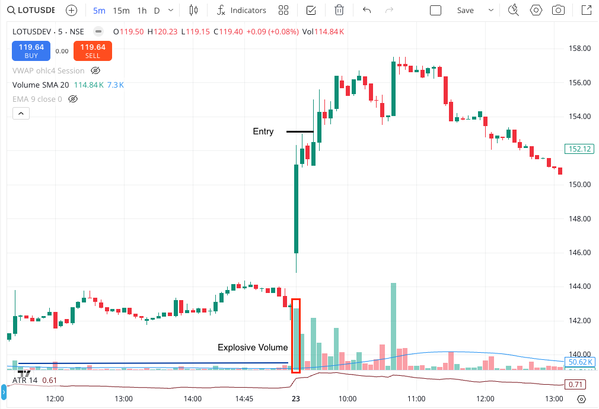
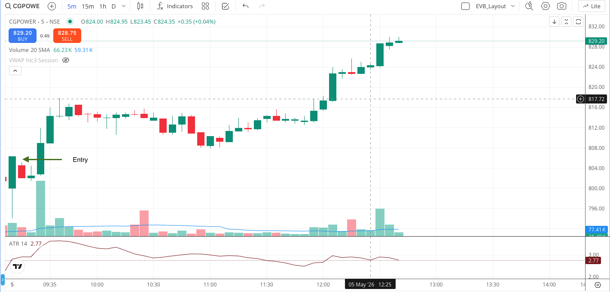
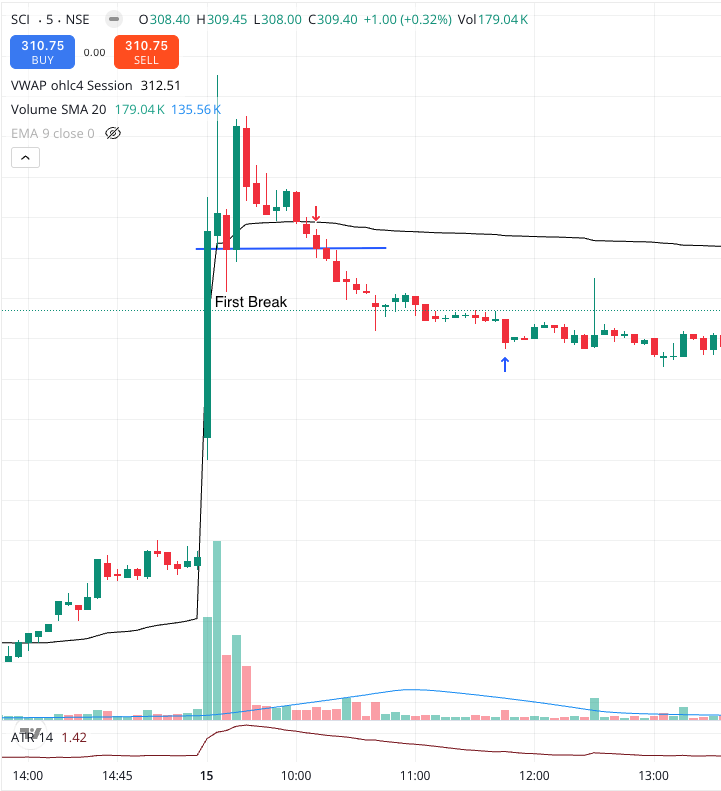
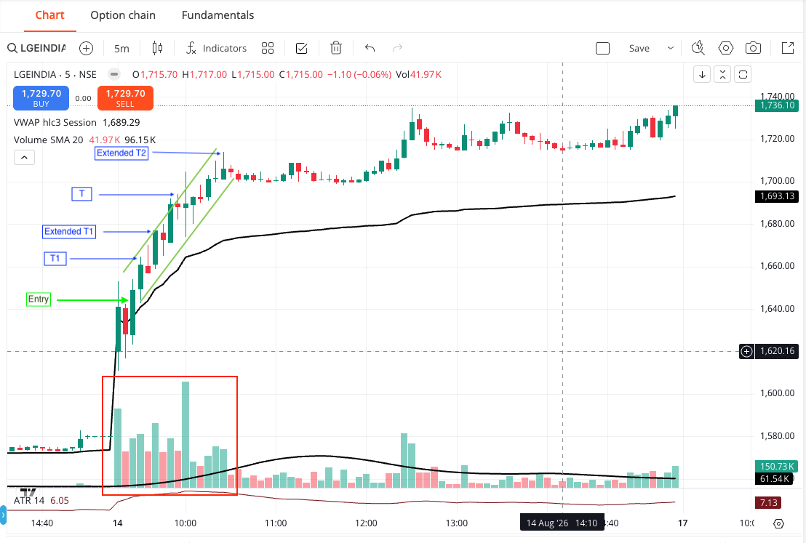
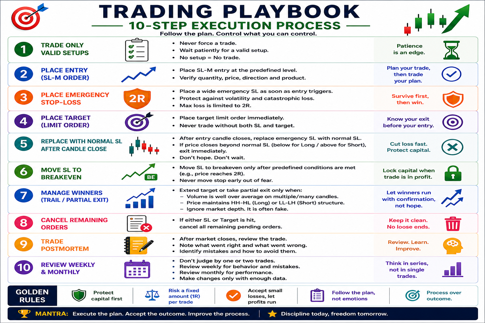

# Intraday Breakout Trade Setup Detection

This script analyzes **5-minute intraday candlestick data** to evaluate breakout setups for a given stock. It applies
**price-action and volume-based filters**, and any setup that passes those checks is sent as a **trade alert via
Telegram**.

The scanner **cannot evaluate higher-level context**—such as sector trend, higher-timeframe trend, or nearby supply
zones—so those must be reviewed **manually before taking any trade**.

## Pipeline Overview

The scanner runs as a three-phase daily pipeline, each phase triggered by a separate cron job.


---

## Phase 1 — Warmup

**Schedule:** `9:15 AM` · Runs once daily

Initializes the trading session by authenticating with the broker and preparing all required runtime data.

### 🔧 Responsibilities

* Sends a **Telegram alert** with the login URL (`https://kite.zerodha.com/connect/login?v=3&api_key=YOUR_API_KEY`) for
  manual authentication
* Once authentication is completed, it proceeds to:

    * Fetch liquid symbols from the `d1_historical_data` table based on **Average Daily Volume (ADV)** and save them to
      a CSV file
    * Resolve and cache **instrument tokens** for all tracked symbols

---

### 🔑 Manual Authentication (Required)

* Clicking the link from Telegram message starts the login flow for Kite Connect API
* This step **cannot be automated**
* On successful login:

    * A fresh **access token** is generated (valid for the trading day)
    * The token is **cached** in SecretManager for downstream processes

---

### ⚠️ Notes

* If authentication is not completed, all dependent processes will fail
* Ensure the login is completed **before market hours**

---

### Phase 2 — Scan

**Schedule:** `9:20 AM` · Runs once daily

Discovers and alerts potential trade setups.

- Loads cached tokens from Phase 1
- Pulls latest candle data from Kite and append to existing data from DB
- Evaluates setup conditions across all symbols
- Fires alerts for qualifying setups

---

### Phase 3 — Backfill

**Schedule:** `3:35 PM` · Runs once daily

Persists candle data to the database for next-day indicator computation.

- Fetches all candles from the last stored timestamp to the market close
- Appends new candles to the historical buffer
- Evicts oldest candles beyond the limit

---

### Execution Order

```
09:15 AM  →  Warmup   (auth + token cache)
09:20 AM  →  Scan     (setup discovery + alerts)
03:35 PM  →  Backfill (candle data persistence)
```

See [`crontab`](crontab) for the full cron schedule.

---

## ✨ Chart Configuration

* **Entry Timeframe**: 5-minute
* **Indicators**: ATR (14) and Volume SMA 20

---

## ✅ Setup

### 🔹 Setup 1 - Explosive Volume Breakout (EVB)

* Stock opens with explosive volume compared to average

  

#### 1. Strong Bullish Breakout Candle

* **Wide body**: Candle body ≥ 60% of total range
* **Small/No upper wick**: Upper wick < 25%

#### 2. Strong Volume

Volume ≥ 15x average volume (SMA 20 volume)

---

### 🔹 Setup 2 — Early Momentum Breakout (EMB)

A stock exhibiting early momentum with tight liquidity conditions.

#### 1. Strong Bullish Breakout Candle

- Candle body spans at least 60% of the total candle range
- Upper wick is less than 25% of the total range

#### 2. Strong Participation

- `MAX_PARTICIPATION_RATE` < 0.5
- Price change between 2% and 6%

> Participation rate refers to the ratio of your order size relative to the volume traded during the breakout candle.

---

### 🔹 Setup 3 - Top Gainers

> **Note:** This is a complementary strategy.

#### Overview

This setup aims to capture early intraday momentum by focusing on the NSE top gainers shortly after market open.



#### Time Window

Scan between **9:20 AM – 9:25 AM** at the start of the trading day. This window captures genuine early movers before the
opening volatility settles.

#### Steps

1. Open the NSE Top Gainers page:
   [https://www.nseindia.com/market-data/top-gainers-losers](https://www.nseindia.com/market-data/top-gainers-losers)

2. Choose an index:All Securities

3. Filtering logic:

* Sort by **traded value (price * volume)** in DESC
* Filter by **price change %** (2-6%)
* Select the **top 2–3 stocks**

4. Optional:

* Download the CSV file and perform filtering locally by
  runnning [nse_top_gainers_scanner_manual_run.py](nse_top_gainers_scanner_manual_run.py)

> Alternatively, select an index (**NIFTY** or **NIFTY NEXT 50**) and apply the filters manually.

#### Selection Filters

* Avoid stocks with **large gap-ups**
* Avoid stocks where **price has already extended significantly**

#### Goal

Identify a small set of liquid stocks showing early strength and attempt to capitalize on initial momentum moves.

> This scanner is completely automated now. Read more here [README.md](intraday/scanner/m5/top_gainers/README.md)
---

## 🔹 Setup 4 — Bull Trap Reversal (BTR)

**Concept:** Identifies stocks that initially showed bullish momentum but failed to sustain it, leading to a reversal.
This setup reuses the same candidates flagged by the Momentum Breakout scanner (from setup 1/2/3), but trades them in
the opposite direction — taking SHORT positions instead of LONG.



**Entry Criteria:**

- Wait for the confirmation candle's low to be broken.
- **Do not enter on the first break.** The first break is treated as a trigger only — not an entry.
- Allow price to retest the confirmation candle low level.
- Enter SHORT only when price breaks below this low a **second time**.

**Filter Condition:**

- The confirmation candle's low must be **below the VWAP** for the setup to be valid.

---

### Disclaimer: No setup works forever. Markets evolve, and setups evolve with them. If you fail to adapt, your edge will gradually disappear. ###

The core mindset shift — treat every setup like a product with a lifecycle. It has a launch phase (edge is strong,
market hasn't adapted), a maturity phase (edge stabilizes, you scale it), and a decay phase (edge erodes, you manage it
down). Most traders only notice they're in decay phase 6 months after it started because they're looking at cumulative
PnL which masks it.

#### What actually helps:

Rolling expectancy windows — don't just track yearly stats. Run a 20-trade and 50-trade rolling expectancy for each
setup. The moment setup 20-trade rolling expectancy started dipping below its 50-trade average consistently, that was
the early warning.

#### Always have a setup in observation mode

New setup discovery should be a continuous background process, not a scramble triggered by breakdown. At any point,
maintain at least one setup in observation mode — paper tracking or minimal live size — so that by the time a primary
setup deteriorates, you already have 3–6 months of live data behind the candidate.
---

## 🧮 Position Size Calculator

Position size is calculated using the logic below.

```
  # Buying power (equity × leverage)
    buying_power = TRADING_CAPITAL * INTRADAY_LEVERAGE_MULTIPLIER
    
    # REAL risk (based on equity)
    risk_amount = TRADING_CAPITAL * MAX_RISK_PER_TRADE_PERCENT

    # Risk-based qty
    risk_based_qty = risk_amount / risk_per_share

    # Capital-based qty (using leverage)
    capital_based_qty = buying_power / entry_price

    tradable_qty = min(risk_based_qty, capital_based_qty)

    # Quantity is rounded to the nearest 5 for convenience.
    if tradable_qty > 5:
        tradable_qty = round(tradable_qty / 5.0) * 5
```

### How to Use

### 📎 [Open Position Size Calculator](https://docs.google.com/spreadsheets/d/17a6biT8HTaTvbsJVUkGBKKUIwe4mWcmqgWH95-mGx9c/edit?usp=sharing)

Enter your **Trading Capital**, **Symbol**, and **ATR** to calculate the recommended **Quantity**, **Stop Loss**, and
**Target**.

> **Entry Price** is preferred. If left blank, the calculator will automatically fetch the symbol's **Day High** via
> Google Finance and use it as the entry price.

```
⚠️ This is a shared read-only template. To use it, go to File → Make a copy to save your own version to Google Drive. All changes should be made in your personal copy.
🔗 If the link is unavailable, download the file directly from this repository and open it in Google Sheets.
``` 

---

## 🎯 Entry Strategy

* Entry: Place your buy order at the high of the confirmation candle, adding a small buffer of 0.25× ATR above it.
* Order Type: Use a SL-M (Stop-Loss Market) BUY order with market protection. This ensures your entry is fully filled
  even during fast price moves — unlike an SL-Limit order, which risks partial or missed fills when the market gaps or
  moves quickly.


``⚠️ SL-M orders can experience slippage during periods of low liquidity or high volatility. In such situations, your order may execute at a higher price significantly different from your intended entry price.``

---

## ❄️ Stop Loss (SL)

* SL: Entry - Risk (0.5× ATR)
* Order Type: Use a SL-M (Stop-Loss Market) SELL order with market protection. This ensures you exit cleanly even during
  fast price moves — unlike an SL-Limit order, which risks partial or missed exits when the market gaps or moves
  quickly.

> As trade progresses, shift SL to latest swing low + buffer. Avoid obvious SL zones known to attract stop hunts.


``⚠️ SL-M orders can experience slippage during periods of low liquidity or high volatility. In such situations, your order may execute at a lower price significantly different from your intended exit price.``

#### Entry Candle Protection Rule

Problem: Normal volatility on the entry candle triggers the stop before the trade has a chance to develop.

Solution: Start with a wider initial stop to withstand entry-candle volatility, then tighten it after the candle closes.

```
                     Entry Filled
                          │
                          ▼
              Activate 2R Emergency Stop
                          │
                          ▼
      Did Emergency Stop Trigger During Entry Candle?
                    │                    │
                  YES                   NO
                    │                    │
                    ▼                    ▼
              Exit at 2R          Wait for Candle Close
                                       │
                                       ▼
                     Is Close Above Normal 1R Stop?
                             │                 │
                           YES                NO
                             │                 │
                             ▼                 ▼
                  Cancel Emergency Stop   Is Close Above
                  Activate Normal 1R SL   Emergency Stop?
                             │                 │
                             ▼          ┌──────┴──────┐
                          Continue      │             │
                         Trade Normally YES           NO
                                         │             │
                                         ▼             ▼
                               Exit at Candle     Already Exited
                               Close (1R–2R)      at 2R Stop
```

---

## 📈 Target Strategy

## 📈 Strategy 1 — Fixed Exit at 3R

* Target: Entry + 3R
* At 3R → Sell 100% of the position
* Best used when the trend lacks strong continuation momentum
* Simple and easy to execute with minimal supervision
* Order Type: Use a Limit SELL order

---

## 📈 Strategy 2 — Partial Exit + Dynamic Trailing

* Primary Target (T1): Entry + 3R
* At 3R → Sell 50% of the position
* Move the SL to breakeven after partial profit booking
* Trail the remaining position below each new swing low to capture extended moves
* Final Target (T2): Exit when T2 is reached, the trailing SL is hit, or the move shows signs of exhaustion.
* Requires active supervision and disciplined trade management
* Order Type: Use a Limit SELL order

## When Should You Switch to a Partial Exit Model?

The answer is relatively simple: **look at what happens immediately after entry.**
Measure participation on the lower timeframe after entry.

Strong Participation

* Volume ≥ 2 × 20-period average for the next 2–3 candles.
* Price maintains bullish structure (higher highs/higher lows).



When the momentum is strong, there are two logical choices:

1. **Extend the target** and allow the entire position to capture more of the move.
2. **Switch to a partial-exit model** — book a portion of the position at the original target and let the remaining
   position run.

Read more here [Exit_Strategy.md](trading-mind-journal/Exit_Strategy.md)

### ⚠️ Important

```
No strategy is perfect. Some trades will reverse after reaching T1, reducing the profit on the remaining position, while others will continue trending strongly and reach T2, resulting in significantly larger gains.

Choose the approach that best matches your personality, risk tolerance, and trading style. Whatever you choose, be mentally prepared for both outcomes and avoid judging the strategy based on just a few trades.

As a general guideline, consider using a partial exit strategy when you observe sustained buying demand—for example, multiple high-volume candles trading well above the average volume—as this can indicate a strong trend with the potential for further upside.
```


---

## 💰 Risk Management

* **Risk per trade**: < 2% of total capital
* **No revenge trading**
* **You will lose.** Your job is to **lose small, fast and smart** and **never let one trade ruin your day**.
* **SL is a validation stop**, not pain threshold.
* When the trade fails structurally, exit. Don’t wait for confirmation of failure.

### 📊 Strategy Performance Summary (EVB)

```Capital = 4L, Backtest Duration = 5 years```

#### Fixed target Backtest Performance

##### Key Metrics Summary

| Metric                              |         Value |
|-------------------------------------|--------------:|
| Capital (₹)                         |       400,000 |
| R (₹)                               |      10,000.0 |
| Total Trades                        |           800 |
| Wins / Losses / BE                  | 331 / 469 / 0 |
| Win Rate                            |         41.4% |
| Avg Win (R)                         |          2.38 |
| Avg Win (R, Theoretical/Uncapped)   |          4.23 |
| Avg Loss (R)                        |         -0.79 |
| Avg Loss (R, Theoretical/Uncapped)  |         -1.00 |
| Win/Loss Ratio                      |          3.01 |
| Expectancy (R, Gross, pre-cost)     |          0.68 |
| Expectancy (₹, Gross, pre-cost)     |        ₹6,762 |
| Expectancy (R, Net, post-cost)      |          0.52 |
| Expectancy (₹, Net, post-cost)      |        ₹5,214 |
| Profit Factor                       |          2.12 |
| Best / Worst Trade (R)              |  4.17 / -1.19 |
| Total R (Gross, pre-cost)           |        540.98 |
| Total R (Net, post-cost)            |        417.13 |
| Total PnL (₹, net)                  |    ₹4,171,303 |
| Max Drawdown (R)                    |         -8.84 |
| Max Drawdown (₹)                    |      ₹-88,359 |
| Max Drawdown (%)                    |        -6.84% |
| Max DD Duration (days)              |           226 |
| Recovery Factor                     |         47.21 |
| Max Losing Streak                   |             9 |
| Max Winning Streak                  |             9 |
| Avg MFE Execution (R)               |         +3.60 |
| Avg MFE Full Day (R)                |        +10.44 |
| Capture Efficiency                  |        49.48% |
| Avg MAE (R)                         |         -2.13 |
| % Trades MAE > 0.5R                 |        69.25% |
| Avg Duration (min)                  |         11.61 |
| Total Flat Brokerage/STT (₹)        |      ₹585,967 |
| Total Slippage Cost (₹)             |      ₹652,528 |
| Total Cost (₹)                      |    ₹1,238,494 |
| Avg Cost / Trade (₹)                |        ₹1,548 |
| Cost Drag (% of Gross PnL)          |        22.89% |
| % Trades Leverage-Constrained       |        92.25% |
| Avg Trades / Month                  |         13.46 |
| Rolling 20-Trade Expectancy (Gross) |        0.87 R |
| Rolling 20-Trade Expectancy (Net)   |        0.72 R |
| Rolling 20-Trade Win Rate           |         45.0% |

---

##### Setup Summary

| Setup | Trades | Win Rate | Avg Win (R) | Avg Loss (R) | Expectancy (Gross R) | Expectancy (Net R) | Total R (Gross) | Total R (Net) |  Total PnL | Profit Factor | Max DD (R) | Max DD (₹) |
|-------|-------:|---------:|------------:|-------------:|---------------------:|-------------------:|----------------:|--------------:|-----------:|--------------:|-----------:|-----------:|
| EMB   |    614 |    41.0% |         2.4 |         -0.8 |                 0.68 |               0.52 |          414.89 |        319.97 | ₹3,199,654 |          2.10 |       -9.8 |   ₹-97,803 |
| EVB   |    186 |    42.5% |         2.2 |         -0.7 |                 0.68 |               0.52 |          126.09 |         97.16 |   ₹971,649 |          2.22 |      -11.3 |  ₹-112,550 |

---

#### Year-wise Performance

| Year | Setup | Trades | Win Rate | Expectancy (Gross R) | Expectancy (Net R) | Total R (Gross) | Total R (Net) | Total PnL | Profit Factor | Max DD (R) | Max DD (₹) |
|-----:|:-----:|-------:|---------:|---------------------:|-------------------:|----------------:|--------------:|----------:|--------------:|-----------:|-----------:|
| 2021 |  EMB  |     40 |    40.0% |                 0.63 |               0.48 |            25.2 |         19.05 |  ₹190,485 |          1.91 |       -4.6 |   ₹-45,978 |
| 2021 |  EVB  |      3 |    33.3% |                 0.57 |               0.41 |             1.7 |          1.22 |   ₹12,214 |          1.91 |       -0.6 |    ₹-6,120 |
| 2022 |  EMB  |     49 |    36.7% |                 0.58 |               0.42 |            28.4 |         20.63 |  ₹206,329 |          1.80 |       -4.3 |   ₹-42,758 |
| 2022 |  EVB  |      6 |    16.7% |                -0.05 |              -0.23 |            -0.3 |         -1.37 |  ₹-13,705 |          0.62 |       -2.9 |   ₹-28,752 |
| 2023 |  EMB  |     67 |    40.3% |                 0.71 |               0.56 |            47.7 |         37.38 |  ₹373,754 |          2.20 |       -3.8 |   ₹-38,000 |
| 2023 |  EVB  |     29 |    20.7% |                -0.02 |              -0.19 |            -0.5 |         -5.50 |  ₹-55,001 |          0.67 |      -10.1 |  ₹-100,698 |
| 2024 |  EMB  |    191 |    40.8% |                 0.65 |               0.50 |           124.6 |         95.00 |  ₹950,038 |          1.98 |       -9.8 |   ₹-97,803 |
| 2024 |  EVB  |     51 |    52.9% |                 0.90 |               0.75 |            45.7 |         38.20 |  ₹382,038 |          2.99 |       -3.1 |   ₹-31,331 |
| 2025 |  EMB  |    147 |    43.5% |                 0.70 |               0.55 |           103.0 |         80.45 |  ₹804,531 |          2.26 |       -4.7 |   ₹-47,244 |
| 2025 |  EVB  |     50 |    42.0% |                 0.72 |               0.57 |            36.2 |         28.40 |  ₹283,976 |          2.35 |       -4.6 |   ₹-46,398 |
| 2026 |  EMB  |    120 |    40.8% |                 0.72 |               0.56 |            86.0 |         67.45 |  ₹674,517 |          2.27 |       -4.5 |   ₹-45,123 |
| 2026 |  EVB  |     47 |    48.9% |                 0.92 |               0.77 |            43.3 |         36.21 |  ₹362,128 |          3.03 |       -3.2 |   ₹-32,478 |

---

### Partial Exit Target - 40% at T1 and 60% at T2

### 📈 Backtest Performance Summary

#### Key Metrics Summary

| Metric                              |         Value |
|-------------------------------------|--------------:|
| Capital (₹)                         |       400,000 |
| R (₹)                               |      10,000.0 |
| Total Trades                        |           800 |
| Wins / Losses / BE                  | 331 / 469 / 0 |
| Win Rate                            |         41.4% |
| Avg Win (R)                         |          2.52 |
| Avg Win (R, Theoretical/Uncapped)   |          4.57 |
| Avg Loss (R)                        |         -0.79 |
| Avg Loss (R, Theoretical/Uncapped)  |         -1.00 |
| Win/Loss Ratio                      |          3.18 |
| Expectancy (R, Gross, pre-cost)     |          0.76 |
| Expectancy (₹, Gross, pre-cost)     |        ₹7,564 |
| Expectancy (R, Net, post-cost)      |          0.58 |
| Expectancy (₹, Net, post-cost)      |        ₹5,775 |
| Profit Factor                       |          2.24 |
| Best / Worst Trade (R)              |  9.88 / -1.19 |
| Total R (Gross, pre-cost)           |        605.10 |
| Total R (Net, post-cost)            |        461.98 |
| Total PnL (₹, net)                  |    ₹4,619,763 |
| Max Drawdown (R)                    |        -11.00 |
| Max Drawdown (₹)                    |     ₹-109,963 |
| Max Drawdown (%)                    |        -9.18% |
| Max DD Duration (days)              |           379 |
| Recovery Factor                     |         42.01 |
| Max Losing Streak                   |             9 |
| Max Winning Streak                  |             7 |
| Avg MFE Execution (R)               |         +4.66 |
| Avg MFE Full Day (R)                |        +10.44 |
| Capture Efficiency                  |        55.79% |
| Avg MAE (R)                         |         -2.33 |
| % Trades MAE > 0.5R                 |        76.12% |
| Avg Duration (min)                  |         19.60 |
| Total Flat Brokerage/STT (₹)        |      ₹586,278 |
| Total Slippage Cost (₹)             |      ₹844,974 |
| Total Cost (₹)                      |    ₹1,431,252 |
| Avg Cost / Trade (₹)                |        ₹1,789 |
| Cost Drag (% of Gross PnL)          |        23.65% |
| % Trades Leverage-Constrained       |        92.25% |
| Avg Trades / Month                  |         13.46 |
| Rolling 20-Trade Expectancy (Gross) |        1.63 R |
| Rolling 20-Trade Expectancy (Net)   |        1.47 R |
| Rolling 20-Trade Win Rate           |         45.0% |

---

#### Target Hit Summary

| Outcome        | Trades | % of Trades | Avg R (Gross / Net) | Avg Duration | Win Rate |
|----------------|-------:|------------:|--------------------:|-------------:|---------:|
| Hit T2         |     71 |       8.88% |       +5.60 / +5.48 |    26.60 min |        — |
| Hit T1, not T2 |    254 |      31.75% |       +1.89 / +1.70 |    30.70 min |  100.00% |
| Never hit T1   |    475 |      59.38% |       -0.57 / -0.76 |    12.60 min |        — |

---

#### Setup Summary

| Setup | Trades | Win Rate | Avg Win (R) | Avg Loss (R) | Expectancy (Gross R) | Expectancy (Net R) | Total R (Gross) | Total R (Net) |  Total PnL | Profit Factor | Max DD (R) | Max DD (₹) |
|-------|-------:|---------:|------------:|-------------:|---------------------:|-------------------:|----------------:|--------------:|-----------:|--------------:|-----------:|-----------:|
| EVB   |    186 |    42.5% |         2.4 |         -0.7 |                 0.78 |               0.60 |          144.87 |        111.74 | ₹1,117,449 |          2.40 |      -10.0 |   ₹-99,868 |
| EMB   |    614 |    41.0% |         2.5 |         -0.8 |                 0.75 |               0.57 |          460.23 |        350.23 | ₹3,502,315 |          2.20 |      -12.8 |  ₹-128,473 |

---

#### Year-wise Performance

| Year | Setup | Trades | Win Rate | Expectancy (Gross R) | Expectancy (Net R) | Total R (Gross) | Total R (Net) |  Total PnL | Profit Factor | Max DD (R) | Max DD (₹) |
|-----:|:-----:|-------:|---------:|---------------------:|-------------------:|----------------:|--------------:|-----------:|--------------:|-----------:|-----------:|
| 2021 |  EMB  |     40 |    40.0% |                 0.70 |               0.53 |            28.2 |         21.18 |   ₹211,840 |          2.01 |       -3.5 |   ₹-34,679 |
| 2021 |  EVB  |      3 |    33.3% |                 0.07 |              -0.12 |             0.2 |         -0.35 |    ₹-3,530 |          0.74 |       -0.6 |    ₹-6,120 |
| 2022 |  EMB  |     49 |    36.7% |                 0.53 |               0.34 |            26.0 |         16.86 |   ₹168,551 |          1.65 |       -4.3 |   ₹-43,495 |
| 2022 |  EVB  |      6 |    16.7% |                -0.28 |              -0.48 |            -1.7 |         -2.87 |   ₹-28,657 |          0.21 |       -2.9 |   ₹-28,752 |
| 2023 |  EMB  |     67 |    40.3% |                 0.48 |               0.30 |            32.4 |         20.27 |   ₹202,690 |          1.65 |       -4.2 |   ₹-42,193 |
| 2023 |  EVB  |     29 |    20.7% |                 0.07 |              -0.11 |             2.1 |         -3.10 |   ₹-30,999 |          0.81 |       -9.0 |   ₹-90,131 |
| 2024 |  EMB  |    191 |    40.8% |                 0.85 |               0.67 |           162.7 |        128.72 | ₹1,287,194 |          2.33 |      -12.8 |  ₹-128,473 |
| 2024 |  EVB  |     51 |    52.9% |                 1.11 |               0.94 |            56.7 |         47.85 |   ₹478,537 |          3.50 |       -3.1 |   ₹-31,331 |
| 2025 |  EMB  |    147 |    43.5% |                 0.71 |               0.52 |           103.8 |         77.08 |   ₹770,775 |          2.21 |       -5.4 |   ₹-53,697 |
| 2025 |  EVB  |     50 |    42.0% |                 0.50 |               0.31 |            24.9 |         15.63 |   ₹156,333 |          1.74 |       -4.9 |   ₹-49,107 |
| 2026 |  EMB  |    120 |    40.8% |                 0.89 |               0.72 |           107.2 |         86.13 |   ₹861,264 |          2.62 |       -5.0 |   ₹-49,974 |
| 2026 |  EVB  |     47 |    48.9% |                 1.33 |               1.16 |            62.7 |         54.58 |   ₹545,764 |          4.05 |       -3.3 |   ₹-32,753 |

> **Disclaimer:** Backtesting assumes perfect trade execution, ideal fills, and decent slippage. It does not account for
> human errors, emotional decisions, execution delays, or real market conditions. Therefore, backtest results should not
> be blindly trusted and should only be treated as an indication of how the strategy performed historically.

#### You can be wrong 60% of the time and still make money, if your winners are bigger than your losers.A trader’s edge isn’t in how often they win, but in how little they lose.


---

#### Stay consistent. Follow the rules. Let the edge play out.


