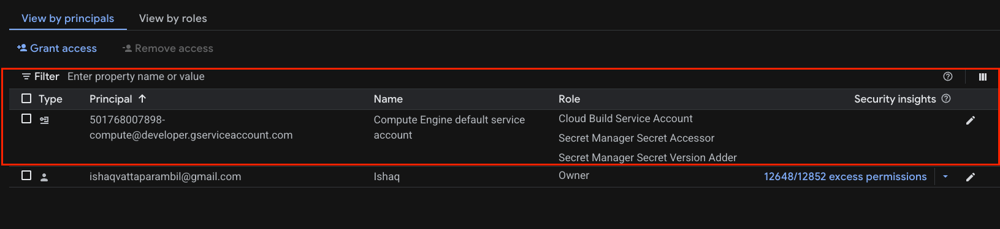
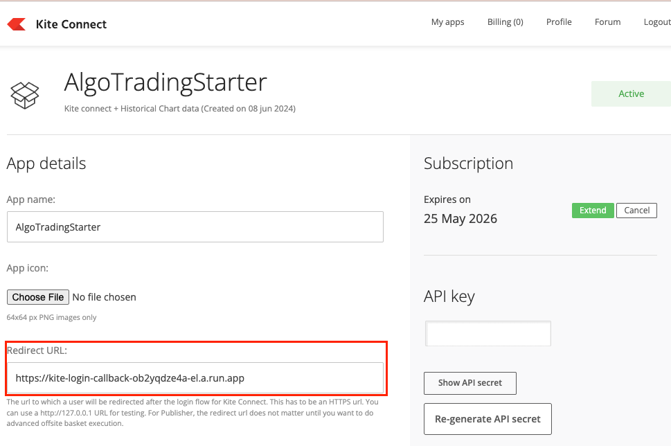

# Kite Login Callback — Setup Guide

Automatically handles the Kite Connect login callback to capture and store the access token, which is then reused by the trading scanner.

---

## Project Structure

```
.
├── main.py             # Cloud Function entry point
└── requirements.txt    # Python dependencies
```

---

## Prerequisites

Before deploying, make sure you have:

- A Kite Connect app on the [Zerodha Developer Dashboard](https://developers.kite.trade/apps) with your **API Key** and **API Secret**
- A **Google Cloud** account with Cloud Functions and Secret Manager enabled
- The **Google Cloud SDK (`gcloud`)** installed and authenticated

---

## Deployment

### 1. Navigate to the project directory

```bash
cd auth/kite
```

### 3. Grant Service Account Permissions(IAM roles)

The default service account needs permission to build artifacts. Run:

```
gcloud projects add-iam-policy-binding <PROJECT_ID> \
  --member="serviceAccount:<PROJECT_NUMBER>-compute@developer.gserviceaccount.com" \
 --role=roles/cloudbuild.builds.builder 
```

The default service account needs permission to read secrets. Run:

```bash
gcloud projects add-iam-policy-binding <PROJECT_ID> \
  --member="serviceAccount:<PROJECT_NUMBER>-compute@developer.gserviceaccount.com" \
  --role="roles/secretmanager.secretAccessor"
```

> Replace `<PROJECT_ID>` with your actual GCP project ID. You can find it by running:
> ```bash
> gcloud config get-value project
> ```

> To get your project number, run:
> ```bash
> gcloud projects describe <PROJECT_ID>
> ```

This can be done from GCP console as well



---

### 2. Deploy the Cloud Function

```bash
gcloud functions deploy kite_login_callback \
  --runtime python312 \
  --region=asia-south1 \
  --trigger-http \
  --allow-unauthenticated \
  --entry-point kite_login_callback \
  --set-secrets KITE_API_SECRET=projects/<PROJECT_ID>/secrets/KITE_API_SECRET:latest \
  --set-secrets KITE_API_KEY=projects/<PROJECT_ID>/secrets/KITE_API_KEY:latest
```

## How the Login Flow Works

### Step 1 — Configure the Redirect URL

In your [Kite Connect app settings](https://developers.kite.trade/apps), set the redirect URL to your deployed Cloud Function's URL.



**Rules for the redirect URL:**
- Must match exactly (no trailing slashes, no wildcards, no query parameters)

### Step 2 — Initiate Login

Open this URL in a browser, replacing `YOUR_API_KEY`:

```
https://kite.zerodha.com/connect/login?v=3&api_key=YOUR_API_KEY
```

### Step 3 — Complete Authentication

1. Log in and complete 2FA on the Zerodha portal.
2. Zerodha redirects to your Cloud Function with a `request_token` in the URL.
3. The function exchanges the `request_token` for an **access token** and stores it securely in GCP Secret Manager.
4. Returns an HTTP `200 OK` on success.

### Flow Summary

```
Manual Login → Zerodha Redirect → Cloud Function → Token Exchange → Stored in Secret Manager
```

---

## Token Validity

| Detail | Info |
|---|---|
| Expiry | Daily, around 6:00 AM IST |
| Refresh token | Not available — login is required every day |

---

## Important Notes

- **Daily login is mandatory.** Tokens expire every day and must be refreshed manually.
- **Do not automate the login flow.** Automating login (e.g., via Selenium or direct API calls) violates Zerodha's terms of service and is fragile.
- **Keep your `access_token` secure.** Treat it like a password — do not log or expose it.